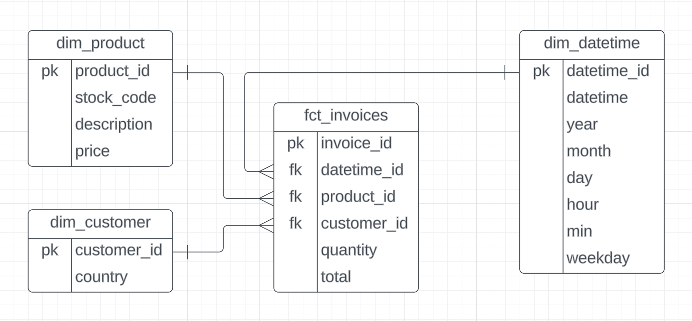
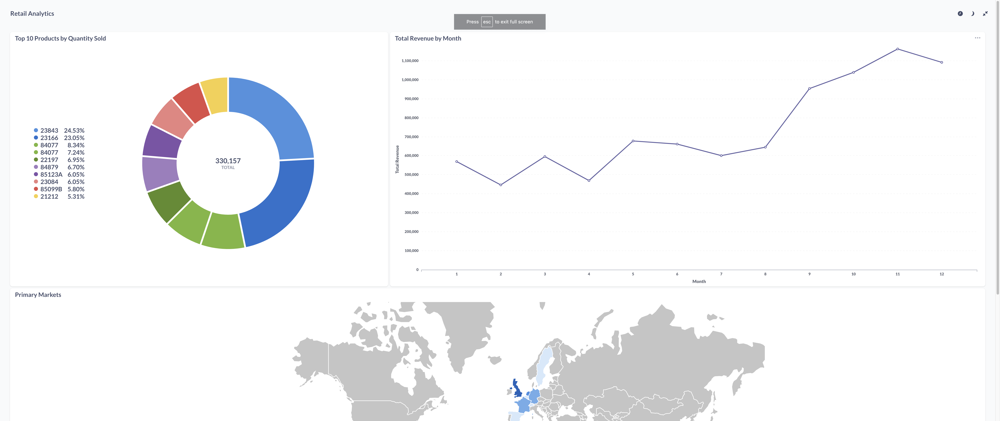

Retail Analytics Pipeline
========

Overview
========
The pipeline collects data from a csv file and then uploads the data to Google Cloud. A quality check is then run with Soda and then dbt is used to transform the data. Another quality check is done with Soda. Afterwards, dbt is used again to build models for the report. A final quality check is performed with Soda before the dashboard is created on Metabase. 

Dataset
================

Dataset can be found [here](https://www.kaggle.com/datasets/tunguz/online-retail)

| Column | Description |
| --- | --- |
| InvoiceNo | Invoice number. Nominal, a 6-digit integral number uniquely assigned to each transaction. If this code starts with letter 'c', it indicates a cancellation. |
| StockCode | Product (item) code. Nominal, a 5-digit integral number uniquely assigned to each distinct product. |
| Description | Product (item) name. Nominal. |
| Quantity | The quantities of each product (item) per transaction. Numeric. |
| InvoiceDate | Invice Date and time. Numeric, the day and time when each transaction was generated. |
| UnitPrice | Unit price. Numeric, Product price per unit in sterling. |
| CustomerID | Customer number. Nominal, a 5-digit integral number uniquely assigned to each customer. |
| Country | Country name. Nominal, the name of the country where each customer resides. |

Pipeline
================

Data Modeling
===========================

Dashboard
=======

